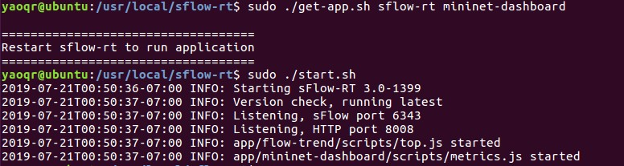

# 0721-SDN获取主机占用带宽

## 目标
1. 寻找SDN中获取或监测主机占用带宽的方法


## 记录

### sFlow-RT分析引擎

sFlow-RT可用于实时采集和分析SDN的流量数据。鉴于Mininet中的Open vSwitch支持sFlow协议，且sFlow官方提供了获取流量数据的API，我们可以通过sFlow-RT来监测Mininet中各个交换机与主机相连端口的速度，从而等效于获得主机当前的占用带宽。

重点在于借用官方提供的```mininet-dashboard```应用、适用于mininet的sflow初始化helper脚本以及API ```/table/{agent}/{metric}/json```。

---

流程如下：

首先下载解压出sFlow后，使用```get-app.sh```脚本安装```mininet-dashboard```应用，随后运行sFlow-RT主程序。



在另一控制台启动mininet，并载入sflow-rt目录下的helper脚本以完成初始化

```shell
$ sudo mn --custom sflow-rt/extras/sflow.py --topo linear,7
```


此时可在浏览器中打开 http://192.168.248.129:8008 访问sflow-rt的前端界面，点击Apps进入```mininet-dashboard```应用。可以看到最近时间各个交换机网络接口的流量传输速度以及点到点连接的数据传输情况。


查阅```mininet-dahboard```源代码后发现，其数据来源是sflow-rt本身提供的table接口，获取当前各个接口一秒内传输的数据量，再转换成各个交换机的网络端口速度在前端图表显示。

```javascript
function calculateTopInterfaces(metric,n) {
  var top = table('TOPOLOGY','sort:'+metric+':-'+n);
  var topN = {};
  if(top) {
    for(var i = 0; i < top.length; i++) {
      var val = top[i][0];
      var port = topologyInterfaceToPort(val.agent,val.dataSource);
      if(port && port.node && port.port) {
        topN[port.node + SEP + port.port] = val.metricValue * 8; 
      }
    }
  }
  return topN; 
}
```

其中```topologyInterfaceToPort()```函数用于提供端口索引号查找得到其对应的端口名称，是sflow-rt在JavaScript中提供的方法。具体实现时我们可以调用REST API中的```topology```接口获取拓扑数据后手动实现。

示例：http://192.168.248.129:8008/topology/json  （其中ports字典中的键名即端口名称，ifindex指的是端口索引号）


table函数则是与REST API中的```/table/{agent}/{metric}/json```相对应。

示例：http://192.168.248.129:8008/table/127.0.0.1/mn_bytes/json   （获取本地客户端下的mn_bytes数据，其中metricValue指该项的测量值，dataSource值是端口索引号，与上文ifindex相对应）


采用Python编写的测试代码成功获取端口流量速度。

```python
from collections import defaultdict
import requests
import json

# get topology data to identify the interfaces
r = requests.get("http://192.168.248.129:8008/topology/json")
topo = json.loads(r.text)
nodes = topo['nodes']

# build a dict with an index-to-name relationship
indexToName = defaultdict()
for switch in nodes: q  
    # all interfaces of a single switch
    ports = nodes[switch]['ports']
    for name in ports:
        # a single interface
        index = ports[name]["ifindex"]
        indexToName[index] = name


# get the current meric value of mininet bytes
# 'TOPOLOGY' is the agent' s name, 'sort:mn_bytes:-' means results will be sorted in reverse order
r = requests.get("http://192.168.248.129:8008/table/TOPOLOGY/sort:mn_bytes:-/json")
portsData = json.loads(r.text)

# build a dict with an name-to-metricValue relationship
portsSpeed = defaultdict()
for port in portsData:
    index = port[0]['dataSource']
    name = indexToName[index]
    portsSpeed[name] = port[0]['metricValue']

print(portsSpeed)
```


