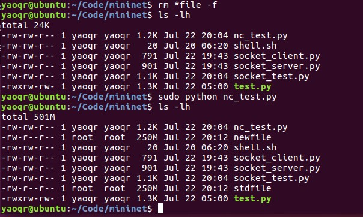
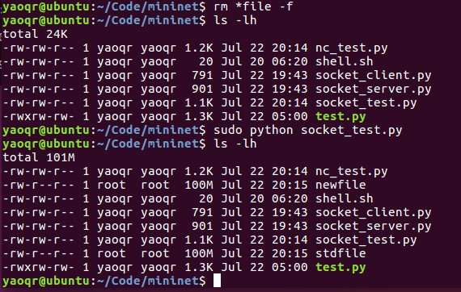

# 0722-方案整理

## 目标

1. 获取主机带宽的方案

2. 数据传输的方案

   

## 记录

### 获取主机带宽

#### 1. sFlow-RT

通过自带的Mininet初始化helper脚本、```Mininet-dashboard```应用和部分REST API，可监测Mininet中各个Switch的端口速度，等效于获得主机的当前占用带宽。此方法与SDN挂钩。

主要用到以下两个API，分别获得Mininet中的拓扑结构数据和端口速度测量值。

http://192.168.248.129:8008/topology/json

http://192.168.248.129:8008/table/TOPOLOGY/sort:mn_bytes:-/json

使用Python语言编写测试程序通过，证实可行。  （详细内容见[0721记录](../0721/0721-SDN获取主机占用带宽.md)）

```python
from collections import defaultdict
import requests
import json

# get topology data to identify the interfaces
r = requests.get("http://192.168.248.129:8008/topology/json")
topo = json.loads(r.text)
nodes = topo['nodes']

# build a dict with an index-to-name relationship
indexToName = defaultdict()
for switch in nodes:  
    # all interfaces of a single switch
    ports = nodes[switch]['ports']
    for name in ports:
        # a single interface
        index = ports[name]["ifindex"]
        indexToName[index] = name


# get the current meric value of mininet bytes
# 'TOPOLOGY' is the agent's name, 'sort:mn_bytes:-' means results will be sorted in reverse order
r = requests.get("http://192.168.248.129:8008/table/TOPOLOGY/sort:mn_bytes:-/json")
portsData = json.loads(r.text)

# build a dict with an name-to-metricValue relationship
portsSpeed = defaultdict()
for port in portsData:
    index = port[0]['dataSource']
    name = indexToName[index]
    portsSpeed[name] = port[0]['metricValue']

print(portsSpeed)
```


#### 2. Linux自带统计数据

Linux系统的 ```/proc/```目录下存放了各种硬件信息和系统运行的统计数据。其中```/proc/net/dev```文件记录了网络接口接收和发送的数据统计信息。可由此进一步处理数据，手动计算出网络接口的速度。

```ifconfig```命令同理。


#### 3. 其它流量监测工具

使用Linux中其他的工具来获取网络接口速度，如 ifstat、nload、iftop、nethogs等等。同样需要进一步处理日志或提取数据。

显然，2、3方法为传统的统计流量方法，脱离了做SDN的初衷。


### 数据传输

这一块的初步思路为：首先根据需求的传输数据量生成指定大小的文件，然后两个节点通过Socket或其它工具传输文件，从而完成节点间指定数据量的传输。

#### 1. 生成指定大小文件

- dd

  ```shell
  $ dd if=/dev/zero of=testfile bs=50M count=1
  ```

  dd通过将一个文件多次拷贝来得到目标文件。其中```if```为输入文件，```/dev/zero```是Linux的一个伪文件，它可以产生连续不断的null流；```of```是输出文件；```bs```是缓存大小，```count```为写入次数，两者乘积为最终输出文件的大小。

- truncate

  ```shell
  $ truncate -s 12M testfile
  ```

  truncate用于快速调整目标文件的大小，如果文件不存在它就会生成一个，用二进制0来填充。```-s```参数指定文件的目标大小。


#### 2. 传输文件

- Netcat

  ```shell
  // for server
  $ nc -l PORT < source_file
  // for clinet
  $ nc IP PORT > target_file
  ```

  NetCat（简称nc）通过TCP或UDP协议传输读写数据，主机间传输文件是其中一种应用。

  首先在服务器端把要传输的文件数据定向到指定端口，同时开始监听请求，然后再在客户端向服务器对应端口发送获取文件的请求。

- Socket

  在两个主机之间建立起TCP连接，要传输的文件按字节流进行传输。一方为服务器端，等待接收文件；一方为客户端，负责发起传输文件的请求。代码如下：

  ```python
  # socket_server.py
  import socket
  import sys 
  import os
  
  FILE_NAME = "newfile"
  
  def receiveFile(addr, port, filename):
      server = socket.socket(socket.AF_INET, socket.SOCK_STREAM)
      server.bind((addr, port))
      server.listen(5)
      conn, clientAddr = server.accept()
  
      tmp = conn.recv(32).decode()
      fileSize = int(tmp.split()[1])
      if fileSize != 0:
          conn.send('ok'.encode())
      else:
          return
      if os.path.exists(filename):
          os.remove(filename)
      with open(filename, 'wb') as f:
          recvSize = 0
          while recvSize < fileSize:
              line = conn.recv(8192)
              f.write(line)
              recvSize += len(line)
          conn.close()
      server.close()
  
  if __name__ == '__main__':
      if len(sys.argv) != 3:
          sys.exit("usage: python socket_server.py [IP_ADDR] [PORT]")
      receiveFile(sys.argv[1], int(sys.argv[2]), FILE_NAME)
  ```

  ```python
  # socket_client.py
  import socket 
  import os
  import sys
  
  FILE_NAME = "stdfile"
  
  def sendFile(addr, port, filename):
      client = socket.socket(socket.AF_INET, socket.SOCK_STREAM)
      client.connect((addr, port))
  
      fileSize = os.path.getsize(filename)
      client.send(('file %d' % fileSize).encode())
  
      if client.recv(2).decode() != 'ok':
          return
      with open(filename, 'rb') as f:
          for line in f:
              client.sendall(line)    
      client.close()
  
  def createFile(filename, size):
      os.system("truncate %s -s %s" % (filename, size))
  
  if __name__ == '__main__':
      if len(sys.argv) != 4:
          sys.exit("usage: python socket_client.py [IP_ADDR] [PORT] [SIZE]")
      createFile(FILE_NAME, sys.argv[3])
      sendFile(sys.argv[1], int(sys.argv[2]), FILE_NAME)3. 在Mininet中测试
  ```

  

#### 3. 在Mininet中测试

- Netcat

  ```python
  from mininet.topo import Topo
  from mininet.net import Mininet
  from mininet.link import TCLink
  from mininet.log import setLogLevel
  
  class CustomTopo(Topo):
      "Single switch with 4 hosts"
  
      def __init__(self, n=4):
          # Initialize topology
          Topo.__init__(self)
          # Add switch
          switch = self.addSwitch('s1')
          # Add hosts and links
          for i in range(1, n + 1):
              host = self.addHost('h%d' % i)
              self.addLink(host, switch, bw=1000)
  
  
  def perfTest():
      topo = CustomTopo()
      # Initialize network with custom topo
      net = Mininet(topo, link=TCLink)
      net.start()
      # Get the host object
      h1, h2 = net.get('h1', 'h2')
  
      # Generate the file of specified size
      # ‘truncate stdfile -s 250M’ also works
      h2.cmd("dd if=/dev/zero of=./stdfile bs=250M count=1")
      # Server: send data to TCP port, and listen for requests
      h1.cmd("nc -l 8888 < stdfile &")
      # Client: send request to server, receive the file
      h2.cmd("nc %s 8888 > newfile" % h1.IP())
  
      net.stop()
  
  if __name__ == '__main__':
      # setLogLevel( 'info' )
      perfTest()
  ```

  测试成功

  

  

- Socket

  ```python
  from mininet.topo import Topo
  from mininet.net import Mininet
  from mininet.link import TCLink
  from mininet.log import setLogLevel
  import time
  
  class CustomTopo(Topo):
      "Single switch with 4 hosts"
  
      def __init__(self, n=4):
          # Initialize topology
          Topo.__init__(self)
          # Add switch
          switch = self.addSwitch('s1')
          # Add hosts and links
          for i in range(1, n + 1):
              host = self.addHost('h%d' % i)
              self.addLink(host, switch, bw=1000)
  
  
  def perfTest():
      topo = CustomTopo()
      # Initialize network with custom topo
      net = Mininet(topo, link=TCLink)
      net.start()
      # Get the host object
      h1, h2 = net.get('h1', 'h2')
      # Server: waiting to receive file
      h1.cmd("python socket_server.py %s 10086 &" % h1.IP())
      # Client: makes the request to send a file
      h2.cmd("python socket_client.py %s 10086 100M" % h1.IP())
  
      # Essential !!  Extra time in need to finish the transmission
      time.sleep(1)
      net.stop()
  
  if __name__ == '__main__':
      # setLogLevel( 'info' )
      perfTest()
  ```

  测试成功

  


## 总结

|     任务     |       方案       |                           主要内容                           |        备注        |
| :----------: | :--------------: | :----------------------------------------------------------: | :----------------: |
| 获取主机带宽 |     sFlow-RT     |   调用sFlow-RT提供的REST API，直接获取相关端口的速度测量值   |     与SDN相关      |
|      -       |  Linux统计数据   | 从```ifconfig```或```/proc/net/dev```处提取总数据量，需进一步手动计算 |  传统流量监控方法  |
|      -       | 其它流量监测工具 | ```ifstat```、```nload```、```iftop```等工具，需从日志提取端口速度 |  传统流量监控方法  |
|   数据传输   |      Netcat      | 使用 ```dd```/```truncate``` 生成指定大小的文件后，两个主机分别用```nc```监听接收和请求发送文件 |       较方便       |
|      -       |      Socket      | 使用 ```dd```/```truncate``` 生成指定大小的文件后，分别启动服务器端和客户端，完成文件传输 | 额外代码（已写好） |

