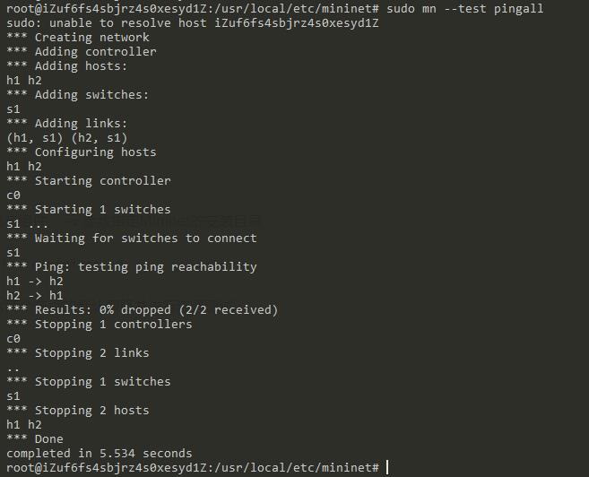
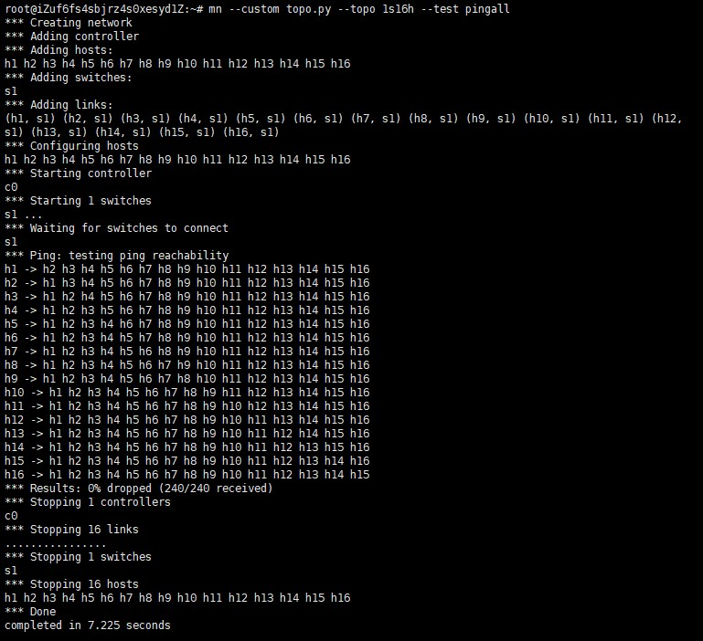
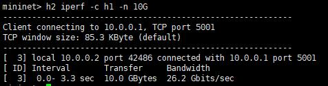
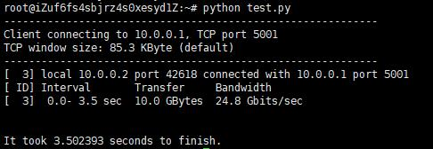

# Notes for Mininet

## 目标

1. 搭建集群
2. 模拟网络状态
3. 节点间传输指定数据量
4. 做SDN，监测当前网络状态
5. 实战例子

## 学习过程记录

### 0.Mininet特点

* 网络仿真系统，可自定义拓扑结构，指定网络参数，运行特定程序及进行网络测试

* 借助轻量级虚拟化技术来创建虚拟节点

* 可通过CLI或Python API操作

### 1.安装流程

这里选择**从源代码安装**的方式。首先从Github中克隆mininet源代码，并执行安装脚本。其中```-a```参数表示安装所有组件与支撑软件，```-s```参数可指定Mininet的安装目录。

```bash
$ git clone git://github.com/mininet/mininet
$ sudo sh ./mininet/util/install.sh -a -s /usr/local/etc/mininet
```

随后通过自带测试来验证mininet的成功安装。当未指定拓扑结构和网络参数时，Mininet默认使用一个包含2个主机和1个交换机的网络。```--test```参数指定节点初始化完成后自动进行的测试，```pingall```即测试各节点两两之间的连通性。




### 2.搭建集群

在Mininet中可使用其中提供的拓扑原型快速搭建出指定拓扑结构。

- 命令行参数

  通过mininet的命令行参数```-topo```来选择经典拓扑结构原型，其中选项包括linear|minimal|reversed|single|torus|tree

  ```bash
  $ sudo mn --topo tree,depth=2,fanout=5 
  ```

  

  

- Python API

  原理同上，选择对应的类新建对象即可。

  ```python
  from mininet.topolib import TreeTopo
  from mininet.net import Mininet
  from mininet.log import setLogLevel
  
  def demo():
      "Simple Demo of Tree Topo"
  
      topo = TreeTopo(depth=2, fanout=3)
      net = Mininet(topo)
      net.start()
      net.pingAll()
      net.stop()
  
  if __name__ == '__main__':
      setLogLevel( 'info' )
      demo()
  ```

  运行结果如下：

  

  

---

Mininet还支持使用Python脚本自定义网络拓扑结构。核心在于编写一个继承```Topo```的类，在该类的初始化方法中声明网络中包含的主机、交换机以及它们之间的连接线。以下是一个关于自定义拓扑结构的例子：

```python
from mininet.topo import Topo

class MyTopo( Topo ):
    "Simple topology example."

    def __init__( self ):
        "Create custom topo."

        # Initialize topology
        Topo.__init__( self )

        # Add hosts and switches
        leftHost = self.addHost( 'h1' )
        rightHost = self.addHost( 'h2' )
        leftSwitch = self.addSwitch( 's3' )
        rightSwitch = self.addSwitch( 's4' )

        # Add links
        self.addLink( leftHost, leftSwitch )
        self.addLink( leftSwitch, rightSwitch )
        self.addLink( rightSwitch, rightHost )

        
# Adding the 'topos' dict with a key/value pair to generate our newly define topology enables one to pass in '--topo=mytopo' from the command line.        
topos = { 'mytopo': ( lambda: MyTopo() ) }
```

其中在最后一行代码中，```topos```是约定用于检索拓扑结构的字典。通过```--custom```参数指定Python源文件，可在mininet的命令行参数中引入用户自定义拓扑结构，并在```--topo```参数处声明当前使用的拓扑名称。

----


假设需要搭建一个包含**16个主机**和**1个交换机**的**星型拓扑结构**网络，步骤如下：

- 编写自定义拓扑文件

  ```python
  from mininet.topo import Topo
  
  class CustomTopo(Topo):
      "Single switch with 16 hosts"
  
      def __init__(self, n=16):
          # Initialize topology
          Topo.__init__(self)
  
          # Add switch
          switch = self.addSwitch('s1')
  
          # Add hosts and links
          for i in range(1, n + 1):
              host = self.addHost('h%d' % i)
              self.addLink(host, switch)
  
  
  # pass to the topos dict
  topos = {
      '1s16h': (lambda: CustomTopo())
  }
  ```

- 命令行参数引入，并执行连通测试
  ```bash
  $ sudo mn --custom topo.py --topo 1s16h --test pingall
  ```

  测试结果如下：
  
  


### 3.自定义网络状态

在mininet中，网络状态的模拟是通过设置主机和链路的状态参数来实现的。

- 主机性能限制

  主要通过提供的```CPULimitedHost```类来实现。首先在添加主机时指明节点可获得的CPU资源占系统总CPU资源的比例，随后在创建网络时把```CPULimitedHost```作为host类型。

  ```python
  from mininet.topo import Topo
  from mininet.net import Mininet
  from mininet.node import CPULimitedHost
  
  class myTopo(Topo):
      def __init__(self):
          switch = self.addSwitch( 's1' )
          f = 0.1
          
          # this host will get f of system cpu
      	self.addHost('h1', cpu=f)
  
  topo = myTopo()
  net = Mininet(topo=topo, host=CPULimitedHost)
  ```

- 链路状态

  与上面类似，在为两个节点添加连接时指明各个性能参数，并在创建网络时选用```TCLink```作为连接类型。

  可选的性能参数包括链路带宽、延迟、丢包率、最大队列大小以及是否使用分层的令牌桶。其中带宽```bw```的默认单位为Mbps，丢包率```loss```单位为百分比。

  ```PYTHON
  from mininet.topo import Topo
  from mininet.net import Mininet
  from mininet.link import TCLink
  
  class myTopo(Topo):
      def __init__(self):
          switch = self.addSwitch( 's1' )
  		host = self.addHost('h1')
          
          # specify the performance parameter of link
          # 10 Mbps, 5ms delay, 2% loss, 1000 packet queue
          self.addLink(host, switch, bw=10, delay='5ms', loss=2,
                       max_queue_size=1000, use_htb=True )
  topo = myTopo()
  net = Mininet(topo=topo, link=TCLink)
  ```

  

### 4.节点间传输指定数据量

```iperf```是一种常用的网络带宽测试工具。mininet内包含iperf测试，可在CLI或者```--test```参数处调用。但该iperf测试仅用于测量两个节点之间的带宽，并不能由用户自定义传输的数据量大小。因此，我们可以通过向节点内传递命令，让其调用真实Linux环境下的iperf程序，从而实现自定义测试数据大小。

使用iperf传输指定大小的测试数据有两步。首先需要在接收端以服务器方式运行iperf，从而等待客户端的请求。然后在发送端以客户端方式运行iperf，提供接收端的IP地址或名称，并使用```-n```参数指明数据大小。

---

该操作可分别通过CLI方式和Python API方式实现。

- CLI方式

  以只含有两个主机的默认网络为例。进入CLI下，在h1主机中以服务器方式运行iperf，同时加入```-D```参数使其挂载到后台以守护进程方式运行。

  

  再在h2主机中以客户端方式运行iperf，指定h1作为接收端，发送10GB的数据。

  

  最后可以看到，在3.3秒的时间内完成了h2到h1的10GB数据传输测试。

- Python API

  ```python
  from datetime import datetime
  from mininet.topo import Topo
  from mininet.net import Mininet
  
  class CustomTopo(Topo):
      "Single switch with 4 hosts"
  
      def __init__(self, n=4):
          # Initialize topology
          Topo.__init__(self)
  
          # Add switch
          switch = self.addSwitch('s1')
  
          # Add hosts and links
          for i in range(1, n + 1):
              host = self.addHost('h%d' % i)
              self.addLink(host, switch)
  
  
  def perfTest():
      topo = CustomTopo()
      # Initialize network with custom topo
      net = Mininet(topo)
      net.start()
      # Get the host object
      h1, h2 = net.get('h1', 'h2')
      
      # Run iperf in server mode on h1 (as daemon)
      h1.cmd('iperf', '-s', '-D')
  
      start = datetime.now()
      # Run iperf in client mode on h2, h1 as the reciever, size 10GB
      # Real IP address is required, rather than host name
      print h2.cmd('iperf', '-c', h1.IP(), '-n', '10G')
      end = datetime.now()
      
      print '\nIt took %f seconds to finish.' % (end - start).total_seconds()
      net.stop()
  
  if __name__ == '__main__':
      perfTest()
  ```

  流程与CLI中的大同小异，主要差别在于Python API中需调用```cmd```函数来向节点发送要执行的命令。值得注意的是，由于不像CLI中一样自动引入了节点名称与IP地址的对应关系，在使用iperf时目标主机应传入具体的IP地址而不是字符串```'h1'```。

  使用Python API的测试结果如下：

  


### 5.监测网络状态

？